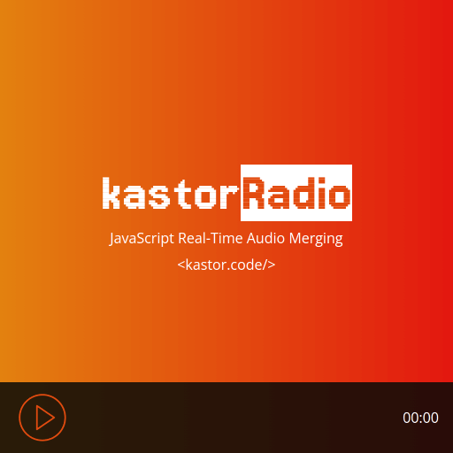
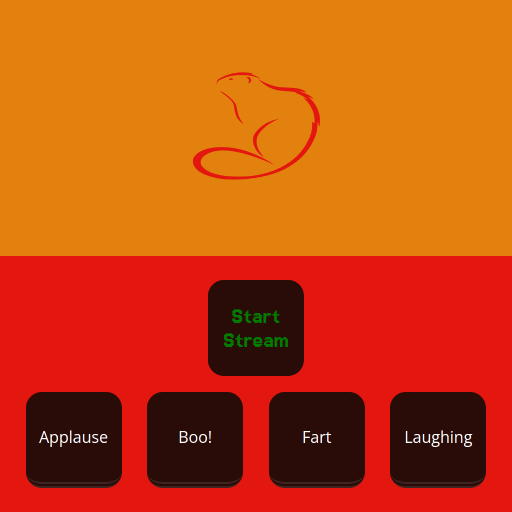

## JavaScript Real-Time Audio Merging with Node.js Streams and SoX

> 👷 Developed by Matheus Ramalho de Oliveira  
🔨 Brazilian Software Engineer  
🏡 Goiânia, Goiás, Brasil  
✉️ kastorcode@gmail.com  
👍 [instagram.com/kastorcode](https://instagram.com/kastorcode)

---

  Full-stack project containerized via Docker that streams and merges audio in real time using Node.js Streams and SoX. All code is tested with Jest, unit and end-to-end tests.

---

### Screenshots

  
  

---

### Installation and execution

Backend

1. Make a clone of this repository;
2. Open the project folder in a terminal;
3. Run `yarn` to install dependencies;
4. Run `yarn start-watch-docker` to launch the docker container server at port `3000`.

Frontend

1. The backend needs to be live;
2. Access the home page (listener) at `http://localhost:3000/home`;
3. Access the radio controller at `http://localhost:3000/controller`.

---

  <big><b>&lt;kastor.code/&gt;</b></big>

